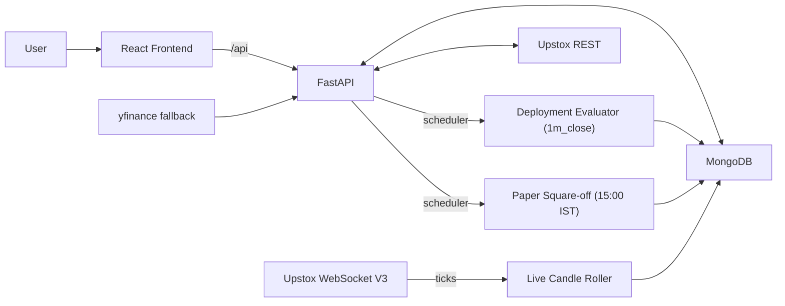
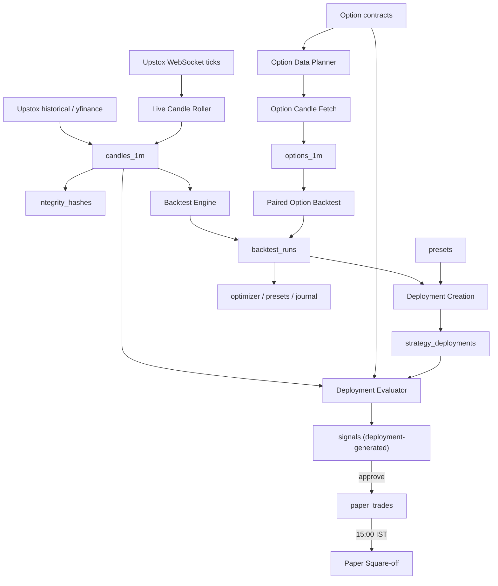

# Architecture

Updated: 2026-05-31

## Purpose

AlphaForge is a local-first research and forward-testing terminal for Indian index options. It stores market data on disk, audits coverage, runs backtests, optimizes parameters, runs strategies forward against live 1-minute closes, and journals every signal with a manual approval gate.

## Stack

| Layer | Technology | Role |
|---|---|---|
| Frontend | React, Tailwind, shadcn/ui, TradingView Lightweight Charts | Trading terminal UI |
| Backend | FastAPI, Pydantic, pandas, NumPy, Motor | API, indicators, strategy execution, evaluators |
| Database | MongoDB | Candles, contracts, audits, runs, presets, deployments, signals |
| Broker | Upstox REST + V3 WebSocket | Historical data, quotes, live ticks |
| Local runtime | Docker Compose | MongoDB + backend + frontend/nginx |
| Optimization | Optuna (TPE, CMA-ES) | Bayesian / Genetic search |

## Runtime Topology

## Data Flow

## Backend Module Map

| File | Responsibility |
|---|---|
| `backend/server.py` | FastAPI routes, request models, scheduler wiring, startup/shutdown hooks |
| `backend/app/db.py` | MongoDB client, `ensure_indexes()` (including `signals_deployment_bar_unique` partial), JSON-safe serialization |
| `backend/app/models.py` | Shared Pydantic models |
| `backend/app/encryption.py` | Fernet-encrypted token storage |
| **Data warehouse** | |
| `backend/app/warehouse.py` | Index candle persistence, coverage, **holiday-aware** audit (uses `nse_calendar.trading_days_in_range`), clear |
| `backend/app/chunking.py` | Auto chunk guidance (uses 7-day chunks for spot to avoid Feb→Mar boundary issue) |
| `backend/app/upstox_client.py` | OAuth, token storage, REST historical, WebSocket authorize URL |
| `backend/app/upstox_stream.py` | V3 read-only WebSocket stream, protobuf decode, sanitized tick persistence |
| `backend/app/upstox_index_ingest.py` | Background index ingest jobs, bulk persistence |
| `backend/app/instruments.py` | Supported index metadata, lot/strike settings |
| `backend/app/options_universe.py` | ATM rounding and moneyness selection |
| `backend/app/option_contract_store.py` | Option contract metadata persistence |
| `backend/app/expired_contract_backfill.py` | Expired option contract metadata backfill |
| `backend/app/option_candles.py` | Option candle normalization and persistence |
| `backend/app/option_coverage.py` | Stored option candle summary by date |
| `backend/app/option_data_audit.py` | Raw option contract/date audit + clear |
| `backend/app/option_data_planner.py` | Preview-first planner with indexed expiry/side/strike lookup |
| `backend/app/option_plan_response.py` | Compact response shaping for option planner |
| `backend/app/option_warehouse_jobs.py` | Background option fetch jobs (selected-date task planning) |
| `backend/app/data_hygiene.py` | Warehouse diff vs desired scope; submits dependency-ordered fetches. Index-friendly aggregations (no `$lookup`) so the plan runs in ~6s, not 120s+ |
| `backend/app/warehouse_autoupdate.py` | Automatic catch-up: guarded plan→execute on startup, OAuth-connect, and a daily 18:00 IST timer; pure decision helpers + `AutoUpdateState` |
| `backend/app/warehouse_lookup.py` | Point-in-time lookup: spot + derived ATM + nearest expiry + ATM CE/PE candles for a given IST date/time (local reads only) |
| `backend/app/warehouse_ohlc.py` | Server-side OHLC resampling (1m→5m/15m/1h/1d on IST buckets) + intraday gap detection (days < 375 stored minutes) |
| `backend/app/option_coverage_cache.py` | Precomputed per-underlying option-coverage cache (`option_coverage_cache` collection) with single-flight lock; fixes the 8s page-load aggregation |
| `backend/app/nse_calendar.py` | NSE 2024–2026 holidays + Budget Saturdays + shifted-expiry days; labeled `calendar_for_year()` for the holiday-calendar modal |
| `backend/app/live_candle_roller.py` | Subscribes to WS broadcast, aggregates per-minute OHLC, persists into `candles_1m` |
| `backend/app/market_header.py` | Normalized market header quote aggregation (WS-first, REST fallback) |
| **Research engine** | |
| `backend/app/indicators.py` | Vectorized indicators |
| `backend/app/regime.py` | Regime detection (ADX + Choppiness + ATR expansion) |
| `backend/app/costs.py` | Realistic Indian intraday cost model |
| `backend/app/backtest.py` | Strategy execution, metrics, statistical significance |
| `backend/app/option_backtest.py` | Paired INDEX + OPTION leg simulation |
| `backend/app/slippage.py` | Slippage config (ATM 0.5pt, OTM1/ITM1 1pt, OTM2+ 2pt, expiry-day 30-min 2x) |
| `backend/app/volatility.py` | Post-hoc 5-min realized vs 30-day baseline detector |
| `backend/app/optimizer.py` | Optuna TPE / Grid / CMA-ES with cancellation, robustness, importance, heatmap |
| `backend/app/strategies/` | Built-in strategies + plugin loader |
| **Forward testing** | |
| `backend/app/strategy_deployments.py` | Deployment doc builder, validation, source resolution |
| `backend/app/strategy_source_hash.py` | SHA-256 of plugin .py file (16 hex truncated) for drift detection |
| `backend/app/deployment_preflight.py` | Spot coverage, expiries, active vs expired contracts, Upstox token state |
| `backend/app/deployment_quality.py` | 5 quality checks; ack required when warnings present |
| `backend/app/deployment_evaluator.py` | 1m_close evaluator, scheduler, time-of-day blocks, expiry cutoff, drift auto-pause |
| `backend/app/signal_lifecycle.py` | Lifecycle state machine and audit events |
| `backend/app/paper_trading.py` | Paper trade create/mark/close, stop/target auto-close |
| `backend/app/paper_squareoff.py` | 15:00 IST background close-all loop with `allow_overnight` opt-out |

## Frontend Module Map

| File | Responsibility |
|---|---|
| `frontend/src/App.js` | Router, layout wrapper, theme provider, **JobsProvider** (global background-job tracker), toaster |
| `frontend/src/lib/theme.jsx` | System / Black / White theme state |
| `frontend/src/lib/jobs.jsx` | Global job tracker mounted above the router: tracks index-ingest + option-fetch jobs and the data-hygiene batch; persists active run IDs to `localStorage` so progress survives navigation/reload |
| `frontend/src/lib/api.js` | Axios wrapper for `/api/*` |
| `frontend/src/index.css` | Design tokens (CSS variables) for both themes |
| `frontend/src/components/Layout.jsx` | Sidebar, top bar, theme selector, global active-jobs indicator, OAuth token-expiry countdown |
| `frontend/src/components/MarketHeader.jsx` | Persistent market quote header |
| `frontend/src/components/DataHygienePanel.jsx` | Data Hygiene hero panel: check (plan) + fill (execute) + auto-update status/toggle |
| `frontend/src/components/WarehouseLookup.jsx` | Spot + ATM CE/PE point-in-time lookup search bar |
| `frontend/src/components/WarehouseChart.jsx` | Per-index candlestick chart (1m/5m/15m/1h/1d), OHLC crosshair legend, date/time locator, gap banner |
| `frontend/src/components/HolidayCalendarDialog.jsx` | NSE/BSE holiday calendar modal with year selector |
| `frontend/src/components/BacktestRunJournal.jsx` | Reusable, collapsible backtest run history table (mounted in Backtest Lab) |
| `frontend/src/pages/Dashboard.jsx` | Status cards |
| `frontend/src/pages/DataWarehouse.jsx` | Sectioned page: Connection, Data Hygiene, Index Data (+chart), Option Data, Verify & Audit (+lookup), Diagnostics |
| `frontend/src/pages/BacktestLab.jsx` | Strategy testing + option pairing + Backtest Run Journal |
| `frontend/src/pages/Optimizer.jsx` | Optimizer workflow |
| `frontend/src/pages/StrategyLibrary.jsx` | Built-in + plugin browser |
| `frontend/src/pages/SignalJournal.jsx` | Deployment signal audit trail (forward-test lifecycle) |
| `frontend/src/pages/PreTradeChecklist.jsx` | Pre-trade checklist profiles |
| `frontend/src/pages/LiveSignals.jsx` | Pending Approval panel + deployment form (PreflightBadge + QualityBadge) |
| `frontend/src/pages/PaperTrading.jsx` | Paper trade journal with risk badges |

## MongoDB Collections

| Collection | Purpose |
|---|---|
| `candles_1m` | Index 1-minute OHLCV |
| `options_1m` | Option premium 1-minute OHLCV + OI |
| `option_contracts` | Option metadata: instrument, expiry_date, strike, side, instrument_key, lot_size |
| `integrity_hashes` | Per-day index candle counts and hashes |
| `warehouse_runs` | Ingest and fetch audit log (covers spot, contracts, options, hygiene) |
| `backtest_runs` | Backtest configs, trades, metrics, option results |
| `optimization_jobs` | Optimizer jobs and best results |
| `presets` | Saved strategy configurations |
| `pretrade_profiles` | Conservative / Balanced / Aggressive plus custom |
| `upstox_tokens` | Encrypted OAuth tokens |
| `ticks` | Sanitized live tick snapshots from the WebSocket stream |
| `signals` | Lifecycle state, reasons, blockers, audit events. Has unique partial index `signals_deployment_bar_unique` over `(deployment_id, candle_ts)` |
| `paper_trades` | Paper fills, mark-to-market, realized/unrealized P&L, source flag |
| `strategy_deployments` | Forward-test deployment definitions |
| `option_coverage_cache` | Precomputed per-underlying option-coverage summary (one small doc per index) for fast Data Warehouse page loads |

## API Routes (High Level)

All routes are prefixed with `/api`. See `docs/API_REFERENCE.md` for full request/response shapes.

### Health and dashboard

- `GET /` `GET /health` `GET /dashboard/summary`
- `GET /market/header` `GET /market/header/stream`

### Strategies and warehouse

- `GET /strategies` `GET /strategies/{id}`
- `POST /warehouse/ingest` (yfinance fallback)
- `GET /warehouse/coverage` `GET /warehouse/runs` `GET /warehouse/audit/{instrument}` (holiday-aware)
- `GET /warehouse/candles/{instrument}` `DELETE /warehouse/data/{instrument}`
- `GET /warehouse/lookup?instrument=&date=&time=` — point-in-time spot + ATM CE/PE
- `GET /warehouse/ohlc/{instrument}?timeframe=&start_ts=&end_ts=&include_gaps=` — resampled candles + gap report
- `GET /warehouse/auto-update/status` `POST /warehouse/auto-update/toggle` `POST /warehouse/auto-update/run`
- `GET /calendar/holidays?year=YYYY` — NSE/BSE holiday calendar for the modal

### Upstox

- `GET /upstox/status` `GET /upstox/auth/start` `GET /upstox/auth/callback` `POST /upstox/disconnect`
- `GET /upstox/market-quote/{instrument}`
- `POST /upstox/stream/start` `POST /upstox/stream/stop` `GET /upstox/stream/status` `GET /upstox/stream/ticks/latest`
- `POST /upstox/warehouse/ingest` `POST /upstox/warehouse/ingest/jobs` `GET /upstox/warehouse/ingest/jobs/{run_id}`
- `GET /upstox/expiries/{instrument}`
- `GET /upstox/options/contracts/{instrument}` `POST /upstox/options/contracts/{instrument}/sync`
- `GET /upstox/expired-options/contracts/{instrument}` `POST /upstox/expired-options/contracts/{instrument}/sync`
- `POST /upstox/options/warehouse/preview` `POST /upstox/options/warehouse/fetch`
- `POST /upstox/options/warehouse/fetch/jobs` `GET /upstox/options/warehouse/fetch/jobs/{run_id}`
- `POST /upstox/options/candles/ingest`

### Data hygiene

- `POST /data-hygiene/plan` — diff desired vs current warehouse, return prioritized actions
- `POST /data-hygiene/execute` — submit fetches in dependency order (spot → contracts → option_candles)
- `GET /data-hygiene/status` — recent hygiene runs

### Live candle roller

- `GET /live-candles/status` `POST /live-candles/start` `POST /live-candles/stop`

### Backtest, optimizer, presets, profiles

- `POST /backtest/run` `GET /backtest/runs` `GET /backtest/runs/{id}` `DELETE /backtest/runs/{id}`
- `POST /optimize/start` `GET /optimize/jobs` `GET /optimize/jobs/{job_id}` `DELETE /optimize/jobs/{job_id}`
- `POST /optimize/jobs/{job_id}/cancel` `POST /optimize/apply-as-preset/{job_id}?name=...`
- `GET /presets` `PUT /presets/{name}` `DELETE /presets/{name}`
- `GET /profiles` `PUT /profiles/{name}`

### Deployments

- `GET /deployments` `POST /deployments` `GET /deployments/{id}`
- `POST /deployments/{id}/pause` `POST /deployments/{id}/resume` `POST /deployments/{id}/archive`
- `GET /deployments/{id}/signals`
- `POST /deployments/{id}/evaluate-on-close` `POST /deployments/evaluate-active`
- `GET /deployments/preflight?instrument=...`
- `GET /deployments/quality?source_type=preset|backtest_run&source_id=...`

### Signals and paper trading

- `GET /signals` `POST /signals` `POST /signals/{id}/transition`
- `POST /signals/{id}/approve` `POST /signals/{id}/skip` `POST /signals/{id}/mark-blocked`
- `POST /signals/{id}/paper`
- `GET /paper/trades` `POST /paper/trades/{id}/mark` `POST /paper/trades/{id}/close`
- `POST /paper/square-off` (manual force close)

### Volatility

- `POST /volatility/audit` — annotates spot 1m bars with realized vs 30-day baseline ratios

### Options local

- `GET /options/candles` `GET /options/coverage` `GET /options/audit/{instrument}` `DELETE /options/data/{instrument}`
- `GET /options/contracts/{instrument}`

## Critical Design Choices

- **Local-first.** The local Docker stack is the source of truth. Online hosting is out of scope.
- **Audit-first.** Every signal carries `bar_ts`, `decision_ts`, strategy id/version/hash, frozen params, pretrade snapshot, regime, option contract, blockers, and `tracked_for_pnl`.
- **Manual approval gate.** No auto-execution on either paper or recommendation. The user clicks Approve.
- **Strict source provenance.** Deployments can be created only from saved presets or saved backtest runs. Direct deployment from a raw plugin is blocked.
- **Strategy source SHA pinned.** Drift between pinned and current SHA auto-pauses the deployment with full audit.
- **Idempotent journaling.** Unique partial index on `(deployment_id, candle_ts)` plus E11000 handling in the evaluator.
- **Time-of-day discipline.** Default blocks: first 10 min and last 30 min of the session. Expiry-day cutoff at 15:00 IST. Auto square-off at 15:00 IST every market day with `allow_overnight` opt-out.
- **No event calendar.** The post-hoc volatility detector replaces this. Reliable scheduled-event timestamps are unavailable.
- **Walk-forward warns, never blocks.** The user makes a conscious choice via the ack checkbox.
- **Lot size is metadata.** Always read from `option_contracts.lot_size` (Upstox-supplied).
- **Expiry resolution is metadata-driven.** Never weekday-hardcoded. The contract picker filters `expiry_date >= today`.
- **CSS variable theming.** The dark and white themes are tokenized; per-panel hex codes are forbidden.
- **Performance: precompute, don't scan on read.** Two page-load aggregations over millions of docs were replaced. Option coverage is served from `option_coverage_cache` (~200ms vs ~8s); the data-hygiene plan groups directly on the embedded `underlying`/`expiry_date` fields in `options_1m` instead of a `$lookup` join (~6s vs 120s+ timeout). Any new read-path aggregation over `options_1m` (5M+ docs) must be cached or windowed.
- **Background jobs survive navigation.** Long-running ingest/fetch/hygiene jobs are tracked by a `JobsProvider` mounted above the router, with active run IDs persisted to `localStorage`. Polling loops must never live in page-local state.
- **Warehouse auto-update.** On startup, on OAuth-connect, and daily at 18:00 IST, the warehouse catches up to yesterday's close via the data-hygiene plan/execute (today's bars come from the live roller). Gated on Upstox connected + not expired; single in-flight guard; user-toggleable.

## Main Risks

- **Upstox token expiry.** The OAuth flow must be re-run when tokens lapse; the evaluator and roller both depend on a valid token.
- **Same-day historical empty.** Without the live candle roller, the evaluator stalls. The roller must be running during market hours.
- **WS subscribed instruments captured at connect time.** Subscription edits in code do not propagate to a running stream — restart it.
- **Big option fetches.** A naive plan can spawn thousands of broker calls. Use Sample, Max contracts, and Missing only. Run month by month for high-accuracy data.
- **Walk-forward divergence is informational.** The ack checkbox is the discipline; the user must use it honestly.
- **Strategy source drift on a long-running deployment.** The evaluator auto-pauses, but the operator must re-create the deployment to resume on a new SHA.

## Operational Notes

- The 1m_close evaluator wakes 10s after each minute boundary during NSE market hours.
- The paper square-off loop runs at 15:00 IST every market day (idempotent).
- The live candle roller auto-starts after WS auto-start at backend boot and auto-flushes on shutdown.
- The pre-flight route is matched before `/deployments/{id}` so the literal path takes precedence.
- The unique partial index is created live on the running DB and reapplied on boot via `ensure_indexes()`.
