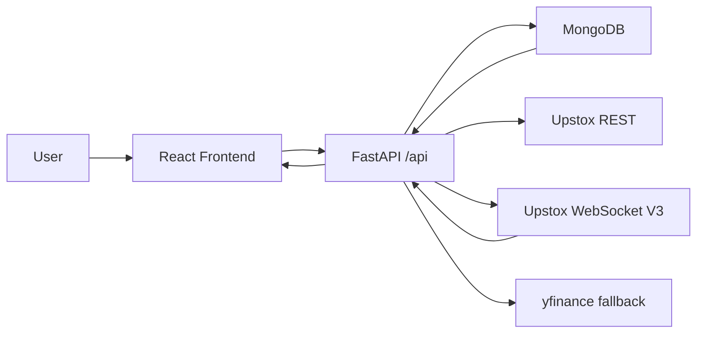
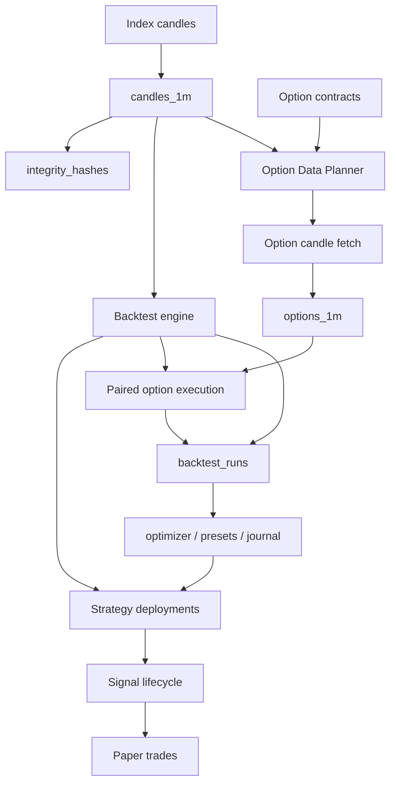

# Architecture

Updated: 2026-05-27

## Purpose

AlphaForge is a local-first research terminal for Indian index-option trading. It stores market data locally, audits completeness, runs backtests, optimizes strategy parameters, and prepares the foundation for live signals and paper trading.

## Stack

| Layer | Technology | Role |
|---|---|---|
| Frontend | React, Tailwind, shadcn/ui, Lightweight Charts | Trading terminal UI |
| Backend | FastAPI, Pydantic, pandas, NumPy | API, indicators, strategy/backtest execution |
| Database | MongoDB via Motor | Candles, contracts, audits, runs, presets |
| Broker | Upstox REST + V3 WebSocket market-data stream | Historical data, quotes, and live ticks |
| Local runtime | Docker Compose | MongoDB + backend + frontend/nginx |

## Runtime Flow

## Data Flow

## Backend Module Map

| File | Responsibility |
|---|---|
| `backend/server.py` | FastAPI app, route definitions, request models, high-level orchestration |
| `backend/app/db.py` | MongoDB client, indexes, JSON-safe serialization |
| `backend/app/warehouse.py` | Index candle persistence, coverage, integrity audit, clear-data helpers |
| `backend/app/chunking.py` | Automatic broker chunk guidance for index and option downloads |
| `backend/app/upstox_client.py` | Upstox OAuth, token storage, historical REST calls, WebSocket authorize URL |
| `backend/app/upstox_stream.py` | Upstox V3 read-only WebSocket stream, protobuf tick decoding, reconnect/backoff, sanitized tick persistence |
| `backend/app/upstox_index_ingest.py` | Background Upstox index ingest jobs and bulk candle persistence |
| `backend/app/instruments.py` | Supported index metadata and lot/strike settings |
| `backend/app/options_universe.py` | ATM rounding and moneyness contract selection |
| `backend/app/option_contract_store.py` | Persist option contract metadata |
| `backend/app/option_candles.py` | Normalize and persist option candles |
| `backend/app/option_coverage.py` | Summarize stored option candles by date for heatmap visibility |
| `backend/app/option_data_audit.py` | Audit option candle coverage by contract/date and clear local option candles |
| `backend/app/option_data_planner.py` | Preview option contracts needed for a spot-history window using indexed expiry/side/strike lookup |
| `backend/app/option_plan_response.py` | Compact option planner responses so long previews do not return huge per-date maps |
| `backend/app/option_warehouse_jobs.py` | Background option candle fetch jobs using selected contract-date windows |
| `backend/app/option_backtest.py` | Pair index trades with option premium candles |
| `backend/app/signal_lifecycle.py` | Signal state machine and audit event history |
| `backend/app/paper_trading.py` | Paper trade creation, stop/target checks, mark-to-market, and close calculations |
| `backend/app/strategy_deployments.py` | Deployment document builder and validation for saved preset/backtest-run sources |
| `backend/app/backtest.py` | Strategy execution and metrics |
| `backend/app/optimizer.py` | Optuna/Grid/CMA-ES parameter search |
| `backend/app/walkforward.py` | In-sample/out-of-sample validation |
| `backend/app/strategies/` | Built-in and plugin strategy implementations |

## Frontend Module Map

| File | Responsibility |
|---|---|
| `frontend/src/App.js` | Router, layout wrapper, toaster, theme provider |
| `frontend/src/lib/theme.jsx` | System/Black/White theme state and DOM application |
| `frontend/src/index.css` | Design tokens, light/dark variables, readability fixes |
| `frontend/src/components/Layout.jsx` | Sidebar, top bar, theme selector |
| `frontend/src/components/MarketHeader.jsx` | Persistent market quote header with collapsible global markets and read-only stream toggle |
| `frontend/src/lib/api.js` | Axios API wrapper |
| `frontend/src/pages/DataWarehouse.jsx` | Broker connection, index ingest, index/option audits, option planner |
| `frontend/src/pages/BacktestLab.jsx` | Backtesting workflow and option pairing controls/results |
| `frontend/src/pages/Optimizer.jsx` | Parameter optimization workflow |
| `frontend/src/pages/Dashboard.jsx` | Status cards and roadmap |
| `frontend/src/pages/LiveSignals.jsx` | Offline signal lifecycle console and Strategy Deployment management; future evaluator/WebSocket strategy feed |
| `frontend/src/pages/PaperTrading.jsx` | Paper trading journal with risk badges and manual mark/close |

## MongoDB Collections

| Collection | Purpose |
|---|---|
| `candles_1m` | Index 1-minute OHLCV candles |
| `options_1m` | Option premium 1-minute OHLCV + OI |
| `option_contracts` | Option metadata: expiry, strike, side, symbol, instrument key |
| `integrity_hashes` | Index per-day candle count/hash |
| `warehouse_runs` | Ingestion and fetch audit log |
| `backtest_runs` | Backtest configs, trades, metrics, option results |
| `optimization_jobs` | Optimizer jobs and best results |
| `presets` | Saved strategy configurations |
| `pretrade_profiles` | Conservative/Balanced/Aggressive filters |
| `upstox_tokens` | Encrypted OAuth tokens |
| `ticks` | Sanitized live tick snapshots from the read-only Upstox market-data stream |
| `signals` | Signal lifecycle state, reasons, context, transition events |
| `paper_trades` | Paper fills, mark-to-market, realized/unrealized P&L |
| `strategy_deployments` | Forward-test deployment definitions from saved presets/backtest results |

## Critical Design Choices

- Expiry selection is based on stored contract metadata, not hard-coded weekdays.
- Option downloads are previewed before broker calls to avoid accidental large workloads.
- Option planner coverage is scoped to selected moneyness/legs/date windows. Raw option audit is scoped to a broader contract metadata slice.
- Long option preview responses are compacted for the UI; exact selected/fetch dates remain available inside fetch-job planning.
- Chunk size is an API reliability setting. Auto chunking is preferred.
- Backtests remain research tools until option slippage, liquidity, and live fill assumptions are modeled.
- Strategy deployment must start from saved presets or saved backtest results, not raw strategy files.
- First forward mode is completed 1-minute candle evaluation; per-tick evaluation is a later manual switch.
- Every live recommendation or paper deployment requires manual approval in the first production path.
- Theme colors are CSS variables so Black and White modes stay readable without per-panel rewrites.
- WebSocket market data is read-only. The stream stores sanitized tick snapshots in `ticks`, never raw broker frames or authorization URLs.
- Market Header prefers fresh WebSocket ticks and falls back to REST/fallback quote sources when ticks are stale, absent, or the market is closed.

## Main Risks

- Historical option backtests need old expired contracts. If those contracts are not stored, expiry mapping cannot be trusted.
- Upstox token/session expiry can interrupt fetches.
- Large option downloads can create many API calls. Use preview, max-contract guard, and Auto chunking.
- Raw universe audit can look alarming after narrow moneyness downloads. It may show many missing contracts because it audits contracts that were never selected by the planner.
- Live signal generation is not complete and must not be treated as production trading logic yet.
- The WebSocket stream still needs multi-session live hardening before it becomes the source for paper-trading marks or deployment evaluation.
